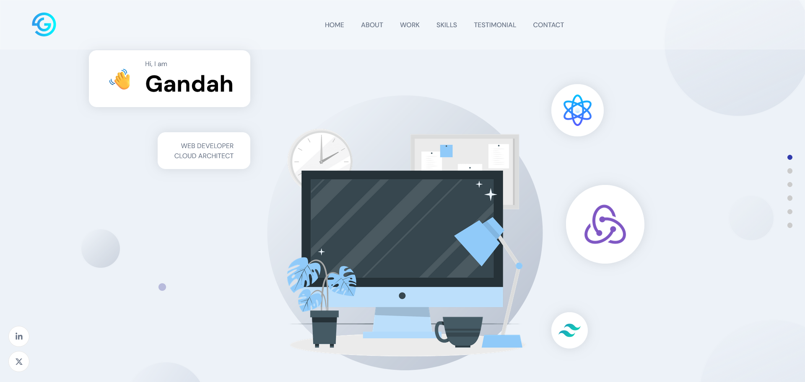
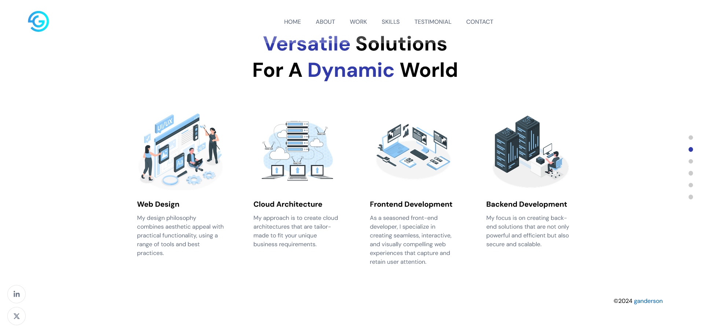
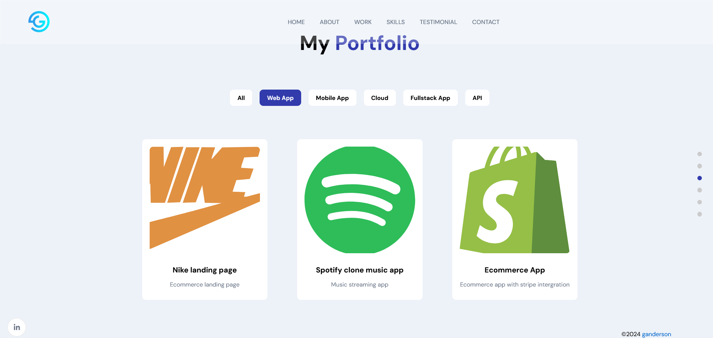

# Portfolio Project - My Porfolio

## Table of contents

- [Portfolio Project - My Porfolio](#portfolio-project---my-porfolio)
  - [Table of contents](#table-of-contents)
  - [Overview](#overview)
    - [Screenshots](#screenshots)
      - [Desktop](#desktop)
    - [Links](#links)
    - [Built with](#built-with)
    - [Continued development](#continued-development)
  - [Author](#author)

## Overview

My porfolio website.

### Screenshots

#### Desktop

### Links

- GitHub Repo: [View Repo](https://github.com/Gandah/my-porfolio-site.git)
- Live Site URL: [Visit Site](https://gandah-porfolio.vercel.app/)
- CMS : [Sanity Studio](https://gandah-portfolio.sanity.studio/)

### Built with

- Sanity CMS
- React tooltip
- Higher order components
- [Tailwind Css](https://tailwindcss.com/) - Css framework
- React icons
- Mobile-first workflow

### Continued development

- Improve user interface

## Author

- Website - [MyLinkedIn](https://www.linkedin.com/in/gandahkelvin)
- Twitter - [@mr_g4nderson](https://twitter.com/mr_g4nderson?t=A5NobjZab2sVEdh3Zq9s0A&s=09)
